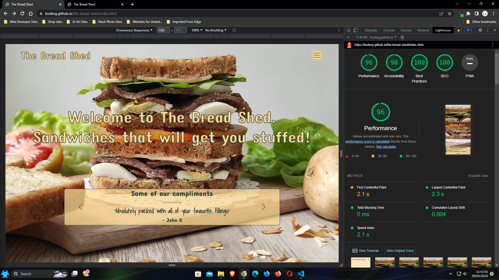
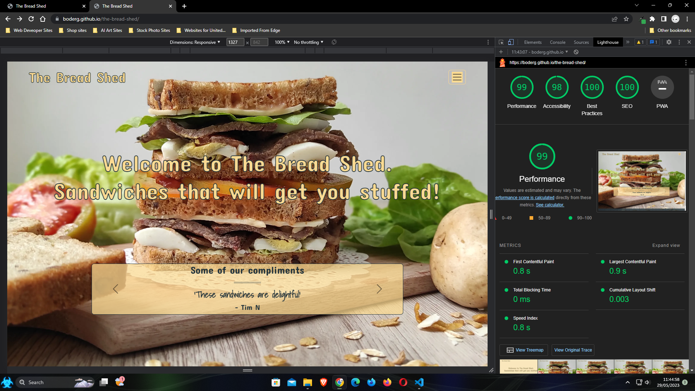
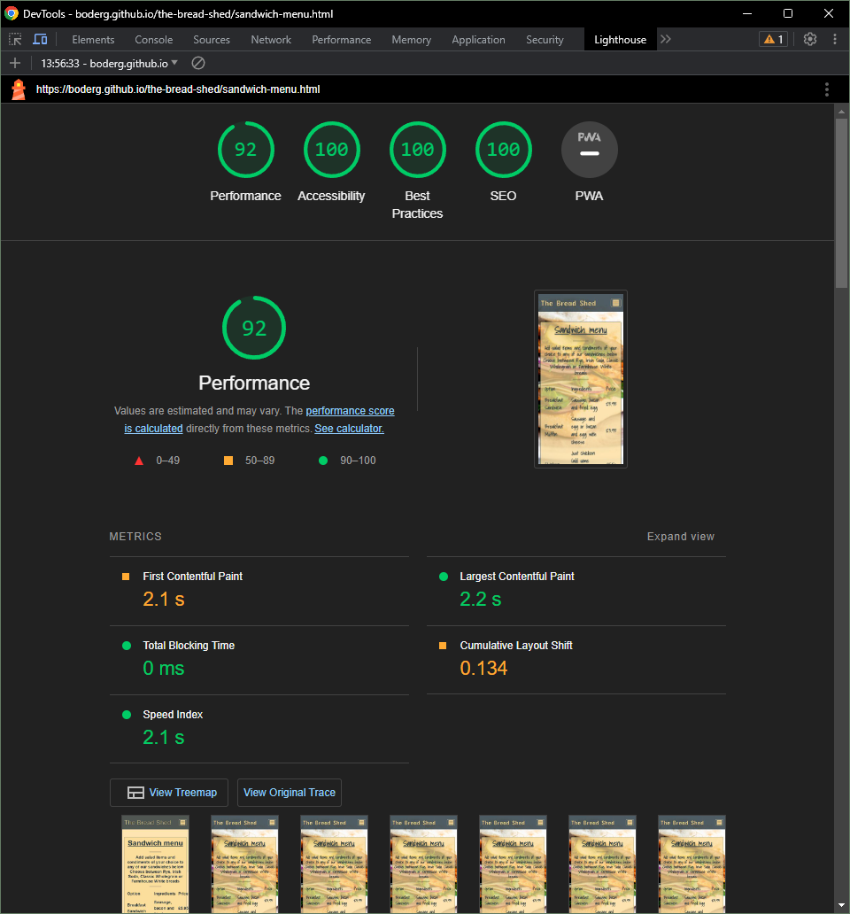
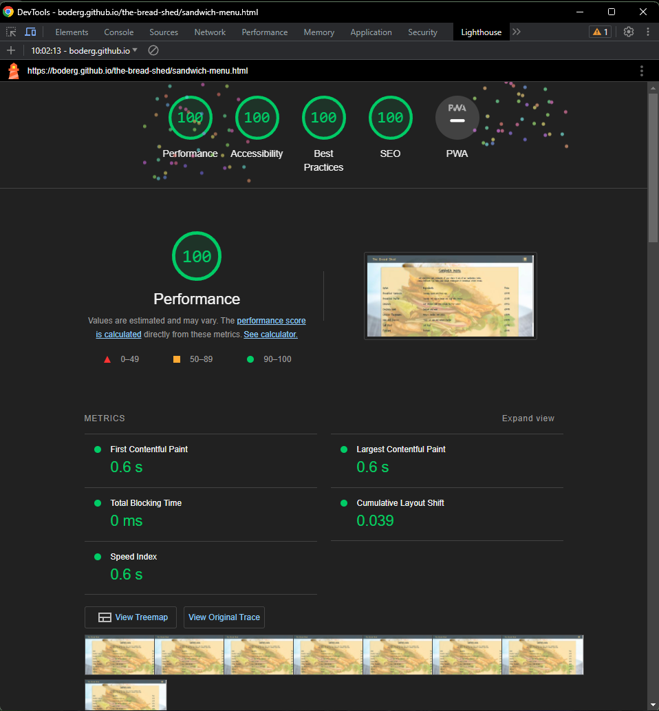
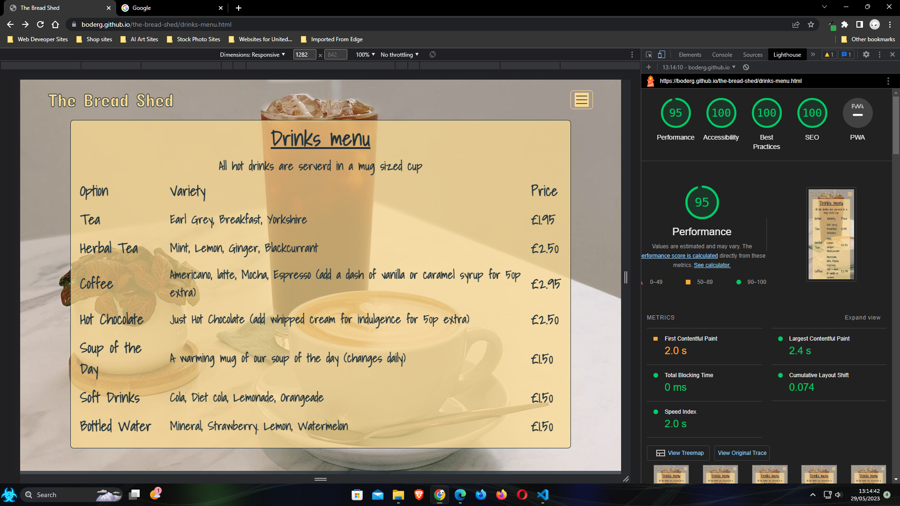
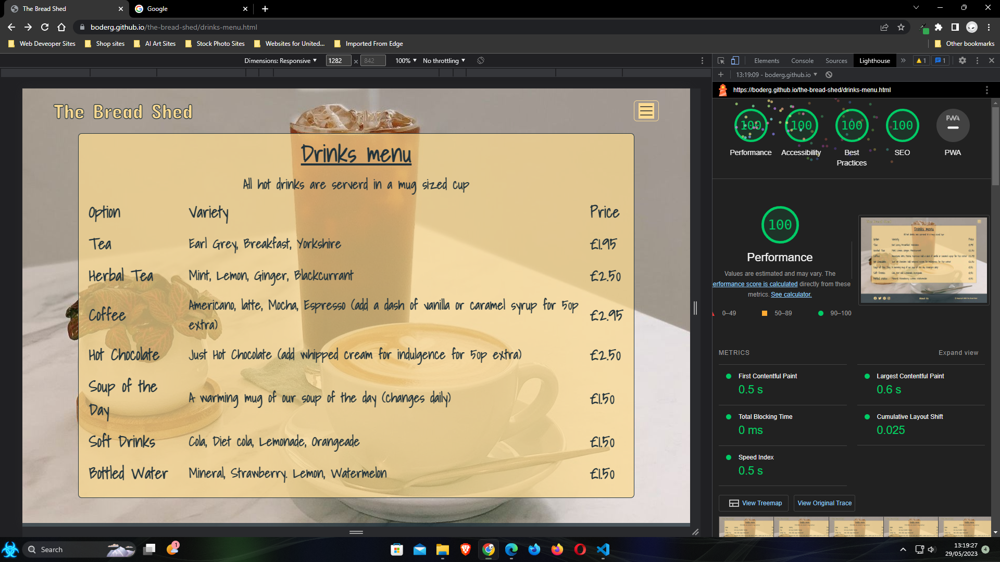
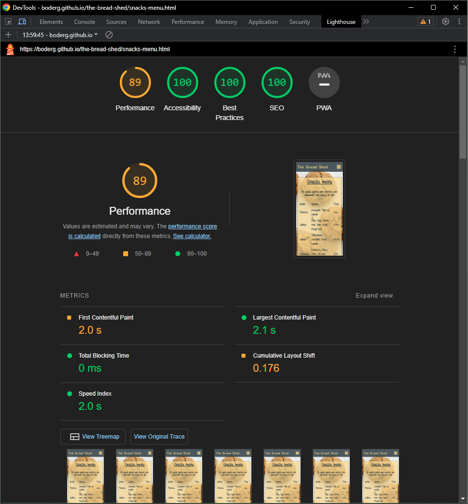
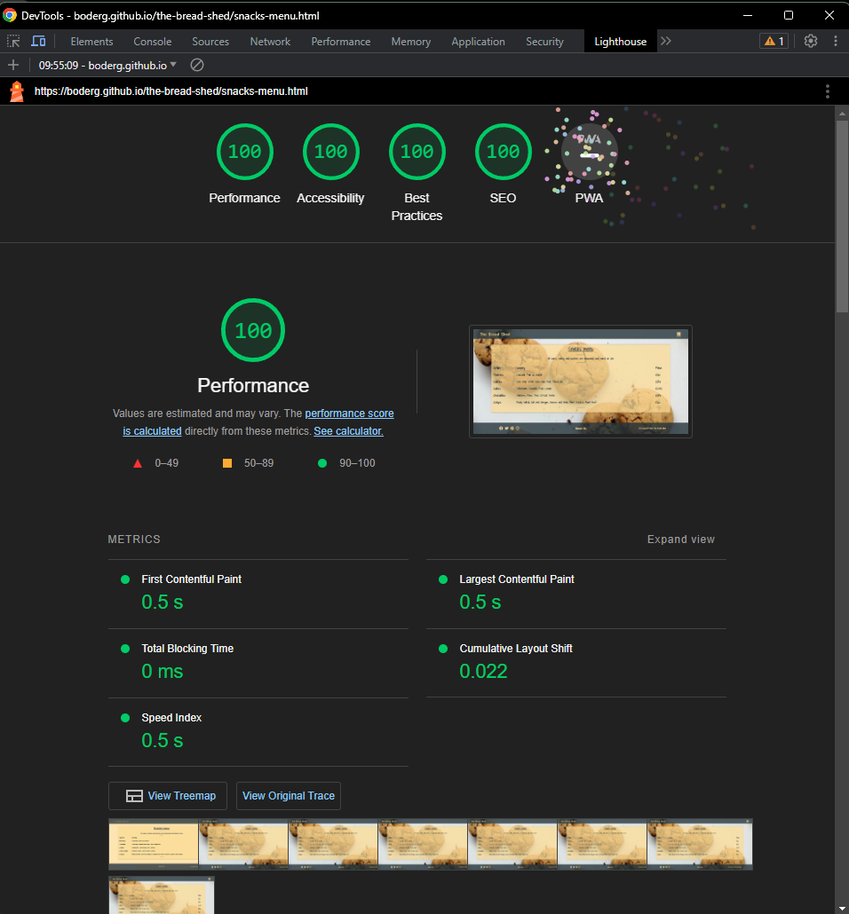
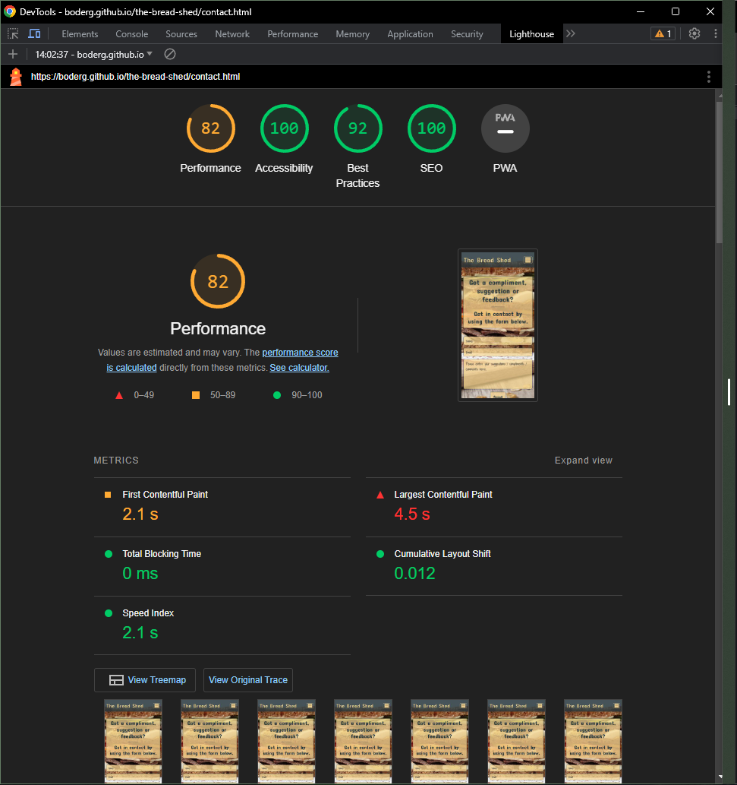
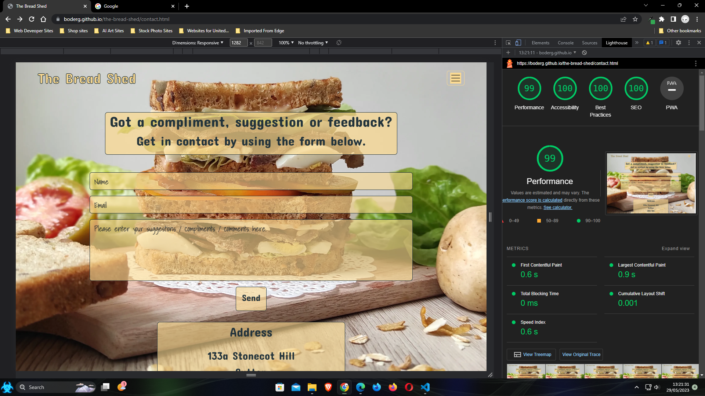

# Testing

Return back to the [README.md](README.md) file.

## Code Validation

### HTML

- I have used the recommended [HTML W3C Validator](https://validator.w3.org) to validate all of my HTML files.
- All files were validated using the live deployed site pages.
- It was noted that all pages had the same error of 1 x closing div missing from the nav section. This was due to the code being re-used from the index file before correction.
- The confirmation page had a space missing from content in the refresh meta tag.
- All errors have been corrected as shown in the table below.

| Page | W3C URL | Screenshot errors | Screenshot fixed | Notes |
| --- | --- | --- | --- | --- |
| Home | [W3C](https://validator.w3.org/nu/?doc=https%3A%2F%2Fboderg.github.io%2Fthe-bread-shed%2F) |  |  | closing div tag missing from nav section - fixed |
| Sandwich Menu | [W3C](https://validator.w3.org/nu/?doc=https%3A%2F%2Fboderg.github.io%2Fthe-bread-shed%2Fsandwich-menu.html) |  |  | closing div tag missing from nav section - fixed  |
| Drinks Menu | [W3C](https://validator.w3.org/nu/?doc=https%3A%2F%2Fboderg.github.io%2Fthe-bread-shed%2Fdrinks-menu.html) |  |  | closing div tag missing from nav section - fixed  |
| Snacks Menu | [W3C](https://validator.w3.org/nu/?doc=https%3A%2F%2Fboderg.github.io%2Fthe-bread-shed%2Fsnacks-menu.html) |  |  | closing div tag missing from nav section - fixed  |
| Contact | [W3C](https://validator.w3.org/nu/?doc=https%3A%2F%2Fboderg.github.io%2Fthe-bread-shed%2Fcontact.html) |  |  | closing div tag missing from nav section - fixed  |
| Confirmation | [W3C](https://validator.w3.org/nu/?doc=https%3A%2F%2Fboderg.github.io%2Fthe-bread-shed%3F) |  |  | closing div tag missing from nav section and space missing from content descriptor in refresh meta tag - fixed  |

### CSS

- I have used the recommended [CSS Jigsaw Validator](https://jigsaw.w3.org/css-validator) to validate all of my CSS files.
- The screenshot shows a pass in relation to the css file that was validated by copy and paste method.
- The copy and paste method was used because the validator is trying to validate the bootstrap elements that have been used.
- The link is for the URL test method and shows many warnings due to the bootstrap elements and vendor specific styles used.

| File | Jigsaw URL | Screenshot | Notes |
| --- | --- | --- | --- |
| style.css | [Jigsaw](https://jigsaw.w3.org/css-validator/validator?uri=https%3A%2F%2Fboderg.github.io%2Fthe-bread-shed%2F&profile=css3svg&usermedium=all&warning=1&vextwarning=&lang=en) |  | Pass: No Errors |

## Browser Compatibility

- I've tested my deployed project on multiple browsers to check for compatibility issues.
- As well as checking for page functionality, all social links were tested to ensure they open in new tabs.
- Each page was tested and a screenshot taken in each of the browsers below. A representation of this is shown in the table below.

| Browser | Screenshot 1 | Screenshot 2 | Notes |
| --- | --- | --- | --- |
| [Brave](https://brave.com/download) |  |  | Works as expected |
| [Chrome](https://www.google.com/chrome) |  |  | Works as expected |
| [Edge](https://www.microsoft.com/edge) |  |  | Works as expected |
| [Firefox (Developer Edition)](https://www.mozilla.org/firefox/developer) |  |  | Works as expected |
| [Opera](https://www.opera.com/download) |  |  | Works as expected |

## Responsiveness

- I've tested my deployed project on multiple devices to check for responsiveness issues.
- The devices tested on were presets within devtools in the chrome browser along with my own personal Samsung Galaxy S10+, 1080p standard monitor and 1440p ultrawide monitor.

| Device | Screenshot | Screenshot | Notes |
| --- | --- | --- | --- |
| Mobile iPhone SE (DevTools) |  |  | Works as expected |
| Tablet iPad Air (DevTools) |  |  | Works as expected |
| Desktop (DevTools)|  |  | Works as expected |
| Standard 1080p 16:9 Monitor |  |  | Works as expected |
| XL Monitor 1440p 21:9 Ultrawide |  |  | Works as expected |
| Samsung Galaxy S10+ (my mobile) |  |  | Works as expected |

## Lighthouse Audit

- I've tested my deployed project using the Lighthouse Audit tool to check for any major issues.
- No major issues were noted.
- Some performance issues noted due to larger content loads.
- All images compressed and converted to .webp format for faster load times.
- All script tags have been placed at the bottom of the html body for faster load times.

| Page | Size | Screenshot | Notes |
| --- | --- | --- | --- |
| Home | Mobile |  | Few warnings |
| Home | Desktop |  | Few warnings |
| Sandwich Menu | Mobile |  | Slow response due to large content |
| Sandwich Menu | Desktop |  | Few warnings |
| Drinks Menu | Mobile |  | Few warnings |
| Drinks Menu | Desktop |  | No warnings to note |
| Snacks Menu | Mobile |  | Few warnings |
| Snacks Menu | Desktop |  | No warnings to note |
| Contact | Mobile |  | Slow response time due to large content |
| Contact | Desktop |  | Few warnings |

## User Story Testing

| User Story | Screenshot |
| --- | --- |
| As a new site user, I would like to easily understand the main purpose of the site, so that I can learn more about what it has to offer. |  |
| As a new site user, I would like to easily navigate through the site, so that I can easily make a choice from what is on offer. |  |
| As a new site user, I would like to easily see what others think, so that I can decide if what is on offer will suit my tastes. |  |
| As a new site user, I would like to easily be able to see their social media interaction, so that I can see if the have any publicised offers or loyalty schemes. |  |
| As a returning site user, I would like to find a good selection, so that I can try something different each time. |  |
| As a returning site user, I would like to be able to make contact, so that I can make suggestions or post comments / testimonials. |  |
| As a returning site user, I would like to find good value, so that I can feel satisfied without breaking the bank. |  |
| As a returning site user, I would like to wide range of drinks and snacks, so that I can compliment my meal choice. |  |
| As a site administrator, I should be able to easily navigate the site, so that I can make necessary alterations. |  |
| As a site administrator, I should be able to find what is needed, so that I can update menus. |  |
| As a site administrator, I should be able to maintain the site, so that I can remove any errors or bugs. |  |
| As a site administrator, I should be able to keep the site running, so that I can limit the downtime and unavailability to customers. |  |

## Bugs

⚠️⚠️⚠️⚠️⚠️ START OF NOTES (to be deleted) ⚠️⚠️⚠️⚠️⚠️

It's very important to document any bugs you've discovered while developing the project.
Make sure to include any necessary steps you've implemented to fix the bug(s) as well.

For JavaScript and Python applications, it's best to screenshot the errors to include them as well.

**PRO TIP**: screenshots of bugs are extremely helpful, and go a long way!

🛑🛑🛑🛑🛑 END OF NOTES (to be deleted) 🛑🛑🛑🛑🛑

- JS Uncaught ReferenceError: `foobar` is undefined/not defined

    

  - To fix this, I _____________________.

- JS `'let'` or `'const'` or `'template literal syntax'` or `'arrow function syntax (=>)'` is available in ES6 (use `'esversion: 11'`) or Mozilla JS extensions (use moz).

    

  - To fix this, I _____________________.

- Python `'ModuleNotFoundError'` when trying to import module from imported package

    

  - To fix this, I _____________________.

- Django `TemplateDoesNotExist` at /appname/path appname/template_name.html

    

  - To fix this, I _____________________.

- Python `E501 line too long` (93 > 79 characters)

    

  - To fix this, I _____________________.

### GitHub **Issues**

⚠️⚠️⚠️⚠️⚠️ START OF NOTES (to be deleted) ⚠️⚠️⚠️⚠️⚠️

An improved way to manage bugs is to use the built-in **Issues** tracker on your GitHub repository.
To access your Issues, click on the "Issues" tab at the top of your repository.
Alternatively, use this link: `https://github.com/boderg/the-bread-shed/issues`

If using the Issues tracker for your bug management, you can simplify the documentation process.
Issues allow you to directly paste screenshots into the issue without having to first save the screenshot locally,
then uploading into your project.

You can add labels to your issues (`bug`), assign yourself as the owner, and add comments/updates as you progress with fixing the issue(s).

Once you've sorted the issue, you should then "Close" it.

When showcasing your bug tracking for assessment, you can use the following format:

🛑🛑🛑🛑🛑 END OF NOTES (to be deleted) 🛑🛑🛑🛑🛑

### Fixed Bugs

All previously closed/fixed bugs can be tracked [here](https://github.com/boderg/the-bread-shed/issues?q=is%3Aissue+is%3Aclosed).

| Bug | Status |
| --- | --- |
| [JS Uncaught ReferenceError: `foobar` is undefined/not defined](https://github.com/boderg/the-bread-shed/issues/1) | Closed |
| [Python `'ModuleNotFoundError'` when trying to import module from imported package](https://github.com/boderg/the-bread-shed/issues/2) | Closed |
| [Django `TemplateDoesNotExist` at /appname/path appname/template_name.html](https://github.com/boderg/the-bread-shed/issues/3) | Closed |

### Open Issues

Any remaining open issues can be tracked [here](https://github.com/boderg/the-bread-shed/issues).

| Bug | Status |
| --- | --- |
| [JS `'let'` or `'const'` or `'template literal syntax'` or `'arrow function syntax (=>)'` is available in ES6 (use `'esversion: 11'`) or Mozilla JS extensions (use moz).](https://github.com/boderg/the-bread-shed/issues/4) | Open |
| [Python `E501 line too long` (93 > 79 characters)](https://github.com/boderg/the-bread-shed/issues/5) | Open |

## Unfixed Bugs

⚠️⚠️⚠️⚠️⚠️ START OF NOTES (to be deleted) ⚠️⚠️⚠️⚠️⚠️

You will need to mention unfixed bugs and why they were not fixed.
This section should include shortcomings of the frameworks or technologies used.
Although time can be a big variable to consider, paucity of time and difficulty understanding
implementation is not a valid reason to leave bugs unfixed.

If you've identified any unfixed bugs, no matter how small, be sure to list them here.
It's better to be honest and list them, because if it's not documented and an assessor finds the issue,
they need to know whether or not you're aware of them as well, and why you've not corrected/fixed them.

Some examples:

🛑🛑🛑🛑🛑 END OF NOTES (to be deleted) 🛑🛑🛑🛑🛑

- On devices smaller than 375px, the page starts to have `overflow-x` scrolling.

    

  - Attempted fix: I tried to add additional media queries to handle this, but things started becoming too small to read.

- For PP3, when using a helper `clear()` function, any text above the height of the terminal does not clear, and remains when you scroll up.

    

  - Attempted fix: I tried to adjust the terminal size, but it only resizes the actual terminal, not the allowable area for text.

- When validating HTML with a semantic `section` element, the validator warns about lacking a header `h2-h6`. This is acceptable.

    

  - Attempted fix: this is a known warning and acceptable, and my section doesn't require a header since it's dynamically added via JS.

⚠️⚠️⚠️⚠️⚠️ START OF NOTES (to be deleted) ⚠️⚠️⚠️⚠️⚠️

If you legitimately cannot find any unfixed bugs or warnings, then use the following sentence:

🛑🛑🛑🛑🛑 END OF NOTES (to be deleted) 🛑🛑🛑🛑🛑

There are no remaining bugs that I am aware of.
